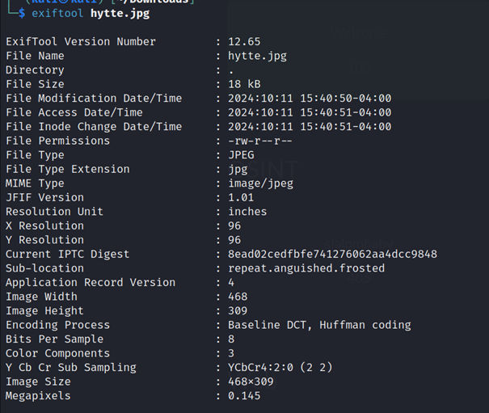
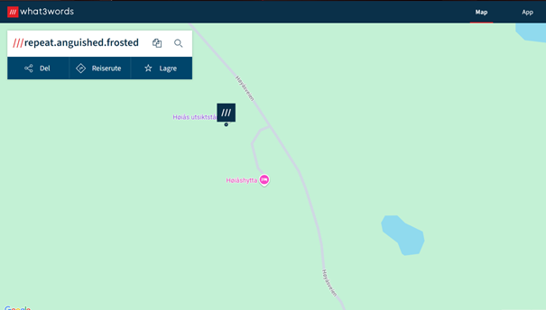

# Challenge: skråstrek3 (454)

### Category: OSINT

### Description
This challenge is presented in Norwegian, adding an extra layer of complexity.

> "Denne hytta har jeg sett før, men jeg vet ikke hvor. Kan du finne ut hva hytta heter? Flag format: SiktCTF{locationofimage}"

 
### Solution

1. **Downloading and Analyzing the Image**:
   I downloaded the `hytte.jpg` image and began by examining its metadata.

   

2. **Using What3Words for Location Identification**:
   I found a What3Words location embedded in the metadata, `repeat.anguished.frosted`.

   

3. **Constructing and Submitting the Flag**:
   The correct flag was `SiktCTF{høgåshytta}`, which was accepted.

### Takeaways
This task demonstrated the use of **metadata analysis** with ExifTool and **What3Words** for geolocation.

